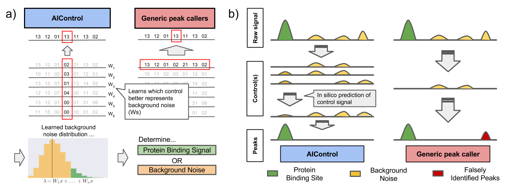

# AIControl

AIControl simulates/imputes control experiments and identify peaks for your ChIPseq data.


## Required libraries for AIControl

Use ```Pkg.add()``` and ```Pkg.clone()``` to install libraries.
- Pkg.add("DataFrames")
- Pkg.add("JLD")
- Pkg.add("Distributions")
- Pkg.clone("https://github.com/slundberg/PureSeq.jl")

## Paper
AIControl:  Replacing matched control experiments with machine learning improves ChIP-seq peak identification ([BioRxiv](https://www.biorxiv.org/content/early/2018/03/08/278762?rss=1))

## Usage
1. Download binned control data from the link on our project website (http://suinlee.cs.washington.edu/projects/aicontrol/). Alternatively, you can bin your own data using ```WriteBinned``` function in the PureSeq package. We are working on the better compression of binned data.  
2. Set parameters appropriately in ```AIControl.config```. Particularly, ```ctrldir```, ```xtxdir```, and ```metafile``` are important. 
3. Call ```julia aicontrol.jl _your_bamfile_hg19mapped_```

<!---
## TOD0
 - switch binning to UInt16 instead of UInt32.
 - add check for recomputing XtXs.
 - merge PureSeq code to this repo if possible.
--->
 
For questions, please e-mail hiranumn at cs dot washington dot edu
